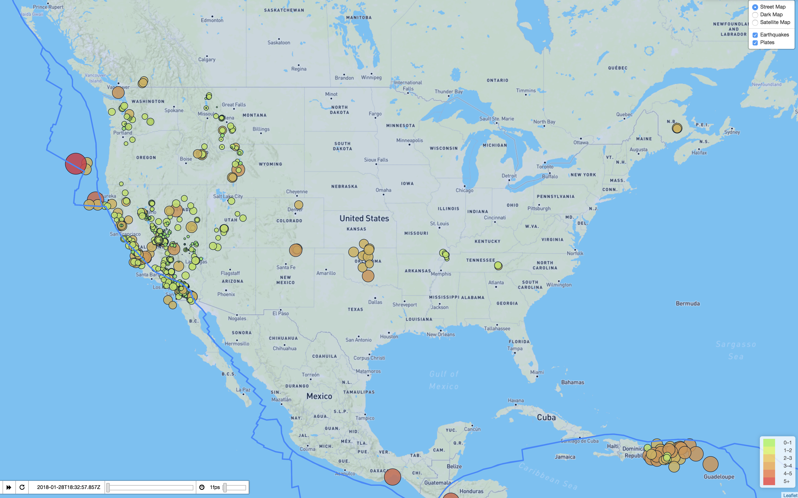

#Leaflet Earthquakes
Methods borrowed from [miriambrk](https://github.com/miriambrk/)

This application creates a map using Leaflet and plots all of the earthquakes from USGS based on their longitude and latitude.
The data markers reflect the magnitude of the earthquake in their size and color. Earthquakes with higher magnitudes are appear larger and darker in color.
Popups provide location, date and magnitude about the earthquake when a marker is clicked.

A legend provides context for the map data.

The map can be viewed as a street map, a dark map, or a satellite view.

A second map of tectonic plates can be overlaid on the main map.

A Leaflet plugin provides for visualizing the earthquakes as they take place over a period of time.

Code used to generate this application:
Javascript, HTML, CSS, Leaflet, D3

Earthquake data provided by calling USGS APIs.

